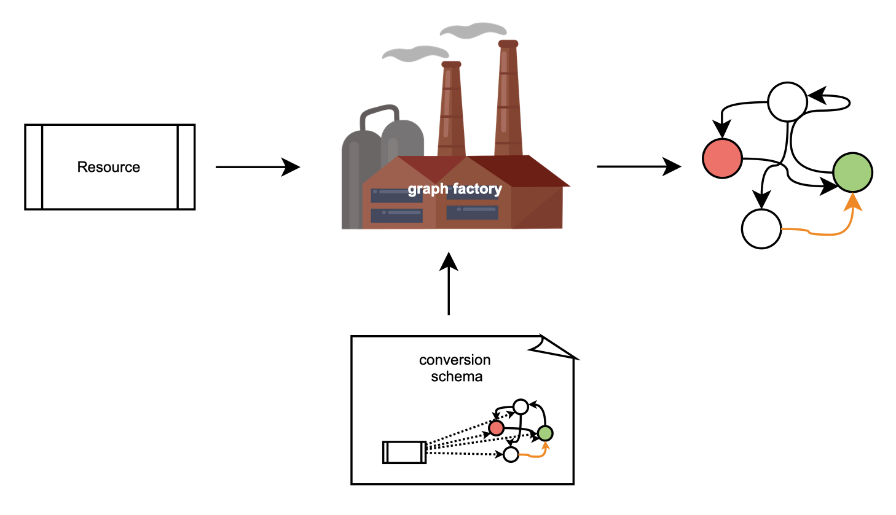
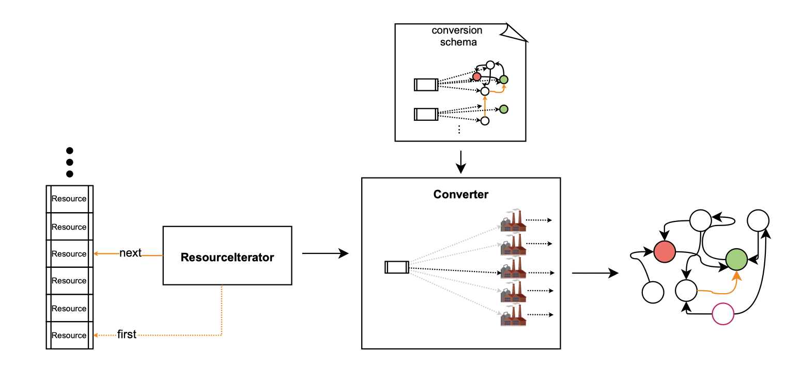
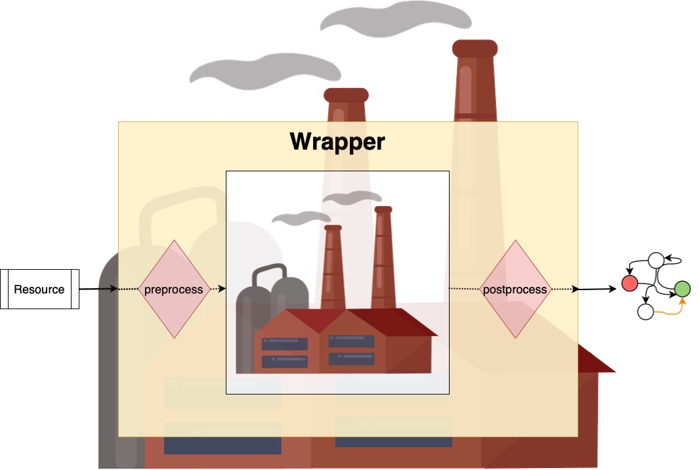

# Documentation
**DOCUMENTATION STILL UNDER CONSTRUCTION**

This is the documentation for the *rel2graph* library. For developers intending to work on the library itself, please refer to [here](#information-for-developers).

For a Quick Start Example please refer to the [ReadMe](../README.md).

## Contents

- [Quick Start Example](../README.md)
- [Introduction](#introduction) 
- [Converter](#converter)
    - [Statefullness](#statefullness)
    - [Logging and progress monitoring](#logging-and-progress-monitoring)
- [Schema Syntax](#schema-syntax)
- [Customizing Resource and ResourceIterators](#customizing-resource-and-resourceiterators)
    - [Resource](#resource)
    - [ResourceIterator](#resource-iterator)
    - [Existing relational modules](#existing-relational-modules)
        - [Pandas](#pandas)
        - [OData](#odata)
    
- [Building your own Wrappers](#building-your-own-wrappers)
    - [Background](#background)
    - [Registering](#registering)
    - [Preprocessors](#preprocessors)
    - [Postprocessors](#postprocessors)
    - [Full Wrappers](#full-wrappers)
- [Information for developers](#information-for-developers)
    - [Testing](#testing)
</br>
</br>

**Rel2graph** is a library that simplifies the convertion of data in relational format to a graph knowledge database. It reliefs you of the cumbersome manual work of writing the conversion code and let's you focus on the conversion schema and data processing.

The library is built specifically for converting data into a [neo4j](https://neo4j.com/) graph. The library further supports extensive customization capabilities to clean and remodel data. As neo4j python client it uses the [py2neo](https://py2neo.org/2021.1/index.html) library.

In the following documentation all classes `SomeClass` can be clicked to get a more detailed developer interface.

## Introduction
This chapter will give you an overview how *rel2graph* works and give you a first intuition on how to interact with it. Details on how the individual parts of the library work can be found in later chapters. Simplified, the library works like a factory that converts an input, some relational data, into an output, a [neo4j](https://neo4j.com/) graph. The factory input is called a [`Resource`](api.md#Resource). A [`Resource`](api.md#Resource) can wrap any relational entity. For every supplied resource the factory will produce a graph. We define a **conversion schema** ahead that specifies the "factory blueprints": what it produces and how. Once the factory is setup and knows the schema, we can keep supplying it with resources without needing to write more code. 



Since there might be different types of resources we build a factory per resource type. One specifies all the "blueprints" for all the factories in a **conversion schema** file. A [`Converter`](api.md#Converter), the main object of *rel2graph*, will take this file and construct all the factories based on your "blueprints". For a set of supplied resource the [`Converter`](api.md#Converter) will automatically select the correct factory, use it to produce a graph out of the resource and merge the produced graph with the full [neo4j](https://neo4j.com/) graph. We supply resources to the converter with a [`ResourceIterator`](api.md#ResourceIterator). This iterator keeps track of what the next resource to process is. The [`Resource`](api.md#Resource) and [`ResourceIterator`](api.md#ResourceIterator) classes can be fully customized. A simple version of it might just point to a specific element in a list of resources, as visualized in the image below. The [`Converter`](api.md#Converter) iteratively asks the [`ResourceIterator`](api.md#ResourceIterator) for the next resource until the iterator reports no more resources to process.



At the simplest the library consists of the following 4 parts: 
- [`Converter`](api.md#Converter): handles all the factories and building the graph.
- The **conversion schema**, specifying what is converted into what. 
- [`Resource`](api.md#Resource): A wrapped relational entity 
- [`ResourceIterator`](api.md#ResourceIterator): An iterator for the to-be-processed resources. You can also use the provided [`IteratorIterator`](api.md#iteratoriterator) to iterate over multiple iterators.

The next chapters will go into detail about these 4 parts. In later chapters we will show you how can insert your custom code into one of these factories by creating [Wrappers](#building-your-own-wrappers). Wrappers can apply a pre- and/or postprocessing to a factory. 



If you wrap for example a node factory, a wrapper first preprocesses the resource, then creates the node with the wrapped factory and lastly postprocess the created node itself. A wrapper behaves itself like a factory and can be wrapped into another wrapper itself. This allows you to insert arbitrary customization into the conversion and adapt it to your usecase.
## Converter
The [`Converter`](api.md#Converter) handles the main conversion of the relational data. It is initialised with the *conversion schema filename*, the iterator and the graph. 
```python
from rel2graph import Converter

converter = Converter(config_filename, iterator, graph)
```
To start the conversion, one simply calls the object. It then iterates twice over the iterator: first to processes all the nodes and then, secondly, to create all relations. This makes sure that any node a relation refers to, is already created first.
```python
converter()
```
The [`Converter`](api.md#Converter) can utilise **multithreading**. When initializing you can set the number of parallel workers. Each worker operates in its own thread. Be aware that the commiting to the graph is often still serialized, since the semantics require this (e.g. nodes must be commited before any relation or when [mergin nodes](#merging-nodes) all the nodes must be serialy commited). So the primary usecase of using multiple workers is if your resources are utilizing a network connection (e.g. remote database) or if you require a lot of [matching](#match) in the graph (matching is parallelised).
```python
converter = Converter(config_filename, iterator, graph, num_workers = 20)
```
**Attention:** If you enable more than 1 workers, make sure that all your [custom wrappers](#building-your-own-wrappers) support multithreading (add locks if necessary).

### Statefullness   
The converter is **stateful**. If you call the converter in a *jupyter notebook* and an exception is raised during the execution of the converter (e.g. due to an KeyboardInterrupt, a network problem, an error in the conversion schema file), you can fix the problem and call the converter again. The converter will the continue its work, where it left of (the resource that was responsible for the exception, will be reconverted). **It is guaranteed that no resource is lost.**

The state of the converter is reset when *initializing it* or when *you change the underlying iterator* with `converter.iterator = new_iterator`. So if you don't want the stateful behaviour you need to do one of these two things.
#### Example 1
You use OData Resources and the network connection suddenly drops out.
In the first cell, you initially have created the converter object and called it.
```python
converter = Converter(config_filename, iterator, graph)
converter()
```
Now a `ConnectionException`is raised due to network problems. You can now fix the problem and then recall the converter in a new cell:
```python
converter()
```
The converter will just continue where it left off. 

#### Example 2
You have a small error in your **conversion schema** for a specific entity (e.g. a typo in an attribute key), which is not immediatelly a problem since you first process a lot other entities. Again in the first cell, you initially have created the converter object and called it.
```python
converter = Converter(config_filename, iterator, graph)
converter()
```
Now e.g. `KeyError `is raised since the attribute name was written slighly wrong. Instead of rerunning the whole conversion (which might take hours) you can fix the schema file and reload the schema file and recall the converter:
```python
converter.reload_config(config_filename)
converter()
```
The converter will just continue where it left off with the new *conversion schema*. 

### Logging and progress monitoring
The whole rel2graph library uses the standart python [logging](https://docs.python.org/3/howto/logging.html) library. See an example on how to use it below. For more information check out the [official documentation](https://docs.python.org/3/howto/logging.html).
```python
import logging

logger = logging.getLogger("rel2graph") # Get Logger
logger.setLevel(logging.DEBUG) # Set the log level to DEBUG
log_formatter = logging.Formatter("%(asctime)s [%(threadName)s]::[%(levelname)s]::%(filename)s: %(message)s") # Specify the format
console_handler = logging.StreamHandler() # Create console handler (will output directly to console)
console_handler.setFormatter(log_formatter) # Add formater to handler
logger.addHandler(console_handler) # add handler to logger

```
When calling a [`Converter`](api.md#Converter) instance you can provide a **progress bar** class, that will be used to display progress. The progress bar class must be an instance of the [tqdm](https://tqdm.github.io) progress bar (or behave like it). 
```python
from tqdm import tqdm
converter(progress_bar = tqdm)
```
You can use any of the tdqm progress bars. For example to monitor the progress via telegram you can use:
```python
from tqdm.contrib.telegram import tqdm
pb = lambda **kwargs: tqdm(token="yourtoken", chat_id="yourchatid", **kwargs) # Config your tokens
converter(progress_bar=pb)
```
## Schema Syntax

The **conversion schema** defines, which relational entities are converted to which graph elements (nodes and relations). As we have seen in the [Introduction](introduction.md), the [`Converter`](api.md#Converter) expects resources as inputs. A resource is a wrapper around a relational entity. Each resource has a *type* associated with it that corresponds to the *type* of entity it wraps. The *type* must be defined for every [`Resource`](api.md#Resource) instance and accessible at `Resource.type`. In the schema file we speficy for each *type* what the [`Converter`](api.md#Converter) should do when it encounters this *type*. The schema allows for one-to-one, one-to-many and many-to-one (with the help of [merging](#merging-nodes)) conversions of relational entities to graph elements (nodes and relations).

Note that the **conversion schema** compiler that the [`Converter`](api.md#Converter) uses to parse the provided schema is limited and does little syntax and no semantic checking. Make sure that you write correct **conversion schema**, otherwise problems or wierd behavior might arise during runtime.

We define this behavior in the schema file. The file follows a modified YAML schema syntax. We will now look at our example from the [Quick Start](../README.md). 
```yaml
ENTITY("Flower"):
    NODE("Flower") flower:
        - sepal_length  = Flower.sepal_length
        - sepal_width = Flower.sepal_width
        - petal_length = Flower.petal_length
        - petal_width = Flower.petal_width
    NODE("Species", "BioEntity") species:
        + Name = Flower.species
    RELATION(flower, "is", species):
    
ENTITY("Person"):
    NODE("Person") person:
        + ID = Person.ID
        - FirstName = Person.FirstName
        - LastName = Person.LastName
    RELATION(person, "likes", MATCH("Species", Name=Person.FavoriteFlower)):
        - Since = "4ever"
```

### Entity

We define the entity *type* with `ENTITY(`*type*`):` following the definitions for the graph elements that this *type* should be converted to. A schema file can contain multiple *type* definitions. Under (in a YAML sense) an entity *type* definition, we can refer to attributes of the *type* with `type.attribute_name`. So if the table for our **"Flower"** entity looks as follows:

**Table "Flower"**
| sepal_length | sepal_width | petal_length | petal_width | species |
|--------------|-------------|--------------|-------------|---------|
| 3.1          | 2.3         | 1.2          | 1.6         | setosa  |
| 2.4          | 1.3         | 1.3          | 0.6         | setosa  |
| ...          | ...         | ...          | ...         | ...     |

we can access the sepal_length attribute with `Flower.sepal_length`.

An entity can be converted into multiple graph elements: `NODE`s and `RELATION`s.

### Node
A node is defined with `NODE(`*label1, label2, ...*`)`, where in between the brackets we define the labels that the nodes should have. We can also define the label based on an attribute of the entity: `NODE(`*type.attributename*`)` (e.g. `NODE("Flower", Flower.species)` to add the species name as label to the node). After a node definition we can specify its internal **identifier**. The identifier is optional and is used for refering to this node, when creating relations as we will see later. The **identifier** is only valid within one entity and therefore must be unique per entity. The full syntax for defining an node is:
`NODE(`*`label1, label2, ...`*`) `**`identifier`**`:`

### Attributes
Under a node or a relation we can define its attributes as follows (indented following YAML format):
`-`*`attribute_name`*`=`*`type.entity_attribute_name`*
Going back to our example, if the node with identifier **flower** should have an attribute named `sepal_length` that contains the value of the attribute `sepal_length` of the entity "Flower", we write 
`- sepal_length  = Flower.sepal_length`.
The attribute name of the node/relation must not be the same as the one of the entity. We could also do 
`- sl  = Flower.sepal_length` 
to get a node with attribute `sl`.

### Relation
A relation is declared with `RELATION(`*source node(s)*`,`*relation type*`,`*destination node(s)*`)`. The relation type is a simple string, that represents the name of the relation. This will create a relation on the kartesian product of the *source node(s)* and the *destination node(s)* (from all sources to all destinations). We have two options on how to set source and destination node: 
- Use a node identifier (note that it must appear above the relation declaration under the same entity). This allows us to set a single node. E.g. in our example we have defined the two node with identifiers `flower` and `species`. We can now define a relation between those too with `RELATION(flower, "is", species)`.
- Use the `MATCH` keyword. With a matcher we can query for arbitrary nodes in the graph. This is useful, when the node we want to refer to is either from a different instance of the same entity or from a different entity (or already existing in the graph). A matcher can return a single or multiple nodes. 

### Match
The match syntax works as follows: `MATCH(`label1`,` label2`,` ...`,`attribute1=value1`,`attribute2=value2`,`...`)`. We first specify the required labels of the searched node(s). We can define arbitrary many labels and the labels themselves can be extracted from the entity as we did with the nodes (e.g. `Flower.species`). We then define the conditions that the nodes we are looking for must meet by specifying which attributes must have which values. We write *myattribute=myvalue*, meaning that any matched node must have the value *myvalue* for its attribute *myattribute*. Again the value can be extracted from the entity (e.g. `Name=Person.FavoriteFlower`). We can specify an arbitrary amount of conditions. 


### Merging Nodes
If we expect that a node is created multiple times and we want to ensure that it is only created once, we can specify a primary attribute. In our example, this would be the case for the node with identifier **species**. If multiple rows of the "Flower" table contain the same entry for the "species" column, the converter will create a node for this species for each row. So for our example table we would end up with at least two "setosa" nodes. What we want, however, is only one node for each species present. 

For this purpose, we can specify a **primary attribute** and a **primary label** to merge a node with the graph. The **primary label** is always the first one mentioned, so we reformulate the node definition to `NODE(`**`primary_label`***`, label2, ...`*`)`. The **primary attribute** is set by replacing the `-` in the attribute definition with a `+`:
`+`*`attribute_name`*`=`*`type.entity_attribute_name`*
If the `Converter` detects that a primary attribute* is set, it will only create a new node if **no** node with the same primary label and primary attribute exists in the graph. If the node already exists, it is updated, i.e. new attributes are added and existing attributes are updated according to the specified values. 

We can also use this to create nodes with informations from different entity types. For example lets assume we had an entity "Person" and an entity "Employee", both of them containing a per-person-unique property:

Table "Person"
| personId | name | ... |
|--------------|-------------|---------|
| ...          | ...         | ...     |


Table "Employee"
| personId | employer | ... |
|--------------|-------------|---------|
| ...          | ...         | ...     |

To create a node that contains both attributes of the entity "Person" and the entity "Employee" we can use the above explained syntax to merge the nodes:
```yaml
ENTITY("Person"):
    NODE("Person"):
        + id = Person.personId
        - name  = Person.name
    
ENTITY("Employee"):
    NODE("Person"):
        + id = Employee.personId
        - employer  = Employee.employer
```
If you now supply for every person both entities to the converter the resulting nodes will have all the attributes `id`, `name` and `employer`. Note if you don't supply both entities for a person the node will only contain the information from the single entity that it got.

### Wrappers
If you have registered wrappers (see [here](#building-your-own-wrappers)) you can refer to them in the **conversion schema**. You simply use the syntax `NameOfWrapper(`wrappedcontent`)`, similar to how you call a function. Find examples below.

Assuming you have defined the attributewrappers `ATTRWRAPPER1` and `ATTRWRAPPER2`, as well as the subgraphwrappers, `SGWRAPPER1` and `SGWRAPPER2`:
```yaml
    - name = ATTRWRAPPER2(ATTRWRAPPER1(Person.personId))
```
```yaml
RELATION(person, ATTRWRAPPER2("likes"), MATCH(ATTRWRAPPER1("Species"), Name=ATTRWRAPPER(Person.FavoriteFlower))):
```
```yaml
SGWRAPPER1(RELATION(person, "likes", MATCH(ATTRWRAPPER1("Species"), Name=ATTRWRAPPER(Person.FavoriteFlower)))):
```
```yaml
SGWRAPPER2(SGWRAPPER1(NODE("Flower"))):
```

Note that the library does no semantic checking of your schema. If you apply an attribute wrapper to a node or a relation, the outcome is undefined and might result in unexpected behavior/exceptions during runtime.

## Customizing Resource and ResourceIterator
The [`Resource`](api.md#Resource) and [`ResourceIterator`](api.md#ResourceIterator) classes are abstract classes and need to be implemented for your specific relational input data type. The library comes with implementations for a few [relational modules](#existing-relational-modules). Implementing them is really easy, see below for an explanation or check out [one of the already implementated modules](./../rel2graph/relational_modules/pandas.py). 

A note on **multithreading**: If you intend to multithread your conversion with multiple workers (see chapter [Converter](#converter)), be aware that `iterator.next()` is not parallelised. If you want to leverage multiple threads for loading of remote data you must implement this in the [`Resource`](api.md#Resource) class (in `__getitem__`).

If you think your implementations could be useful for others as well, read through the chapter [Information for Developers](#information-for-developers) and create a pull request.
### Resource
The [`Resource`](api.md#Resource) is simply a wrapper around a relational entity. To create your own resource, your create a new class and inherit from [`Resource`](api.md#Resource). The parent constructor must be called with no arguments. Additionally, you need to implement following methods: `type`,`__getitem__`,`__setitem__`, `__repr__`. See the docs strings below for more details.
```python
from rel2graph import Resource
class MyResource(Resource):
    def __init__(...your constructor parameters...):
        super().__init__()
        # your constructor code
        ...

    @property
    def type(self) -> str:
        """
        Returns the type of the resource as a string. The @property decorator makes this a property of the resource. The type is
        then accessible via resource.type whithout braces.
        """
        ...

    def __getitem__(self, key: str) -> str:
        """
        Returns the value at key 'key' of the underlying relational entity. 
        Makes an item retrievable via resource["mykey"].
        """
        ...
    
    def __setitem(self, key: str, value: str) -> None:
        """
        Sets/Changes the value of the underlying relational entity at key 'key'. 
        It must be able to change existing key and also add new keys.
        Makes an item settable via resource["mykey"] = "somevalue".
        """
        ...

    def __repr__(self) -> str:
        """
        Gets a string representation of the resource. Only used for logging.

        Should follow the format:
        NameOfResource 'TypeOfResource' (DetailsAboutResource)
        
        super().__repr__() returns "NameOfResource 'TypeOfResource'"

        Example-Implementation:
        f"{super().__repr__()} ({self.somedetail})"
        """
        return f"{super().__repr__()} ({... some detail about your resource ...})"
    
```

### ResourceIterator
If you create your own [`Resource`](api.md#Resource), you also need to create a [`ResourceIterator`](api.md#ResourceIterator) for this [`Resource`](api.md#Resource) that allows the [`Converter`](api.md#Converter) to iterate over a set of resources. The iterator needs to be written such that it can be traversed multiple times (The [`Converter`](api.md#Converter) will traverse it once for all nodes and then again for all relations). 

Your iterator class must inherit from [`ResourceIterator`](api.md#resourceiterator) and its constructor must call the parent constructor with no arguments. Additionally, you need to implement following methods: `next`,`reset_to_first`,`__len__`. See the docs strings below for more details. Note that your iterator can also traverse resources of different type.

```python
from rel2graph import ResourceIterator
class MyIterator(ResourceIterator):
    def __init__(self, ...your constructor parameters...) -> None:
        super().__init__()
        ...

    def next(self) -> Resource:
        """Gets the next resource that will be converted. Returns None if the range is traversed."""
        ...
    
    def reset_to_first(self) -> None:
        """Resets the iterator to point to the first element"""
        ...

    def __len__(self) -> None:
        """
        Returns the total amount of resources in the iterator. This is only required if you use a progress bar and is used to compute the percentage of completed work
        """
        ...
```
### IteratorIterator
The [`IteratorIterator`](api.md#iteratoriterator) allows you to iterate over multiple "sub"-iterators. There are no restrictions on the "sub"-iterators, as long as they are of type [`ResourceIterator`](api.md#resourceiterator). Since an [`IteratorIterator`](api.md#iteratoriterator) is also of type [`ResourceIterator`](api.md#resourceiterator), it can be used recursively.
```python
from rel2graph import IteratorIterator
iterator1 = ... # An iterator
iterator2 = ... # Another iterator
itit = IteratorIterator([iterator1, iterator2])
```
### Existing relational modules
#### Pandas
With the [`PandasDataFrameIterator`](api.md#pandasdataframeiterator) you can wrap a [pandas dataframe](https://pandas.pydata.org/pandas-docs/stable/reference/api/pandas.DataFrame.html?highlight=dataframe#pandas). If you pass a pandas dataframe to the [`PandasDataFrameIterator`](api.md#pandasdataframeiterator) it will automatically create [`PandasSeriesResource`](api.md#pandasseriesresource)s out of all rows (series) and iterate over them. Since a dataframe has no type assiciated with it, you need to additionally provide a type name.
```python
from rel2graph.relational_modules.pandas import PandasDataframeIterator
iterator = PandasDataframeIterator(pandas.Dataframe(...), "MyType")
```
#### OData
With the [`ODataListIterator`](api.md#odatalistiterator) you can iterator over a list of OData entities from [pyodata](https://pyodata.readthedocs.io/en/latest/). The entities need to be of type or behave like [*pyodata.v2.service.EntityProxy*](https://pyodata.readthedocs.io/en/latest/).
```python
from rel2graph.relational_modules.odata import ODataListIterator
iterator = ODataListIterator([entity1, entity2,...])
```

## Building your own Wrappers
A wrapper allows you to inject custom code into the conversion. A wrapper inserts preprocessing and postprocessing before and after a wrapped factory. There are three possibilities on how to create such factory wrappers. The simplest way is to just define either an **preprocessor** (processing the [`Resource`](api.md#Resource) before it is passed to the factory) or a **postprocessor** (processing the output of the factory). They are created by writing a simple python function. If you need more sophisticated functionality that uses both you can define a full wrapper class. This chapter will guide you throught the creation of your own wrappers.


### Background
First we need to be aware of the different factory types *rel2graph* uses. The input of every factory is always a resource, but depending on the type the output varies. To write wrappers we need to distinguish the two main factory types: **SubGraphFactories** and **AttributeFactories**. 


#### AttributeFactories
*AttributeFactories* produce `Attribute` objects. An `Attribute` is a simple object, that behaves as follows:
```python
from rel2graph import Attribute
myattr = Attribute("mykey", "myvalue")
key = myattr.key # get the key of the attribute
value = myattr.value # get the value of the attribute
```
An `Attribute` is immutable, so it can't be changed. If you want to change it you need to create a new one. 

Whenever you refer to an entity attribute the parser in the [`Converter`](api.md#Converter) will create an *AttributeFactory* (for example `mykey = EntityName.attribute` or just `EntityName.attribute`). Note that a static attribute will also create an AttributeFactory that will just ignore the entity (for example `key = "staticstring"`). Given a resource the AttributeFactory that is created from `mykey = EntityName.attribute` will produce the attribute `Attribute("mykey", **value at resource.attribute**)`.

#### SubGraphFactories
*SubGraphFactories* produce, as the name suggests, a py2neo [Subgraph](https://py2neo.org/2021.1/data/index.html#subgraph-objects) object, containing py2neo [Nodes](https://py2neo.org/2021.1/data/index.html#node-objects) and [Relationships](https://py2neo.org/2021.1/data/index.html#relationship-objects). When your write `NODE(...)` or `RELATION(...)` in the schema file, the parser will create a *NodeFactory* or a *RelationFactory* respectively out of your specification. Both of them are *SubGraphFactories*. The *NodeFactory* returns a subgraph with maximum one node and the *RelationFactory* returns a subgraph with an arbitrary amount of relationships. The nodes and relations of a subgraph can be accessed with `subgraph.nodes` and `subgraph.relationships`. Please checkout the documentation of the py2neo objects for details about how to operate with them (click on the links).

### Registering
When we write a pre/postprocessor function or even a full wrapper class, we need to register it, such that the [`Converter`](api.md#Converter) knows of its existence. Registering is done with python **decorators**. When registering pre/postprocessors we need to specify if its for an *AttributeFactory* or for a *SubGraphFactory*. A full wrapper class needs no further specification. The following decorators are available for registering:
- `register_attribute_preprocessor`
- `register_attribute_postprocessor`
- `register_subgraph_preprocessor`
- `register_subgraph_postprocessor`
- `register_wrapper` 

The library will not check if your registered functions/classes match the expected format. If the function behaves other that expected, this will result in undefined behavior during runtime. Make sure you define your functions/classes correctly.

### Preprocessors
A preprocessor transforms the resource before it reaches the factory. To define a preprocessor, we write a function that takes a resource as input. If a factory gets `None` as input it will simply create nothing. Therefore, if you want the factory to only produce an object if a condition is given, you can write a preprocessor and return `None` if the resource does not meet the condition.

We can pass static (string) arguments to a preprocessor from the schema file. Simply add them in your function as parameters behind the resource and specify the arguments in the schema file.
Some examples:
```python
from rel2graph import register_attribute_preprocessor, register_subgraph_preprocessor

@register_attribute_preprocessor
def my_attr_preprocessor(resource):
    # do something to the resource
    ...
    return resource

@register_subgraph_preprocessor
def only_create_subgraph_if_preprocessor(resource, key, value="can also have a default value"):
    """Only creates the subgraph if resource[key] == value"""
    if resource[key] != value:
        return None # do not create this subgraph
    return resource
```
`schema.yaml`
```yaml
ENTITY("type"):
    my_subgraph_preprocessor(NODE("label"), "somekey", "specificvalue"):
        - mykey = my_attr_preprocessor(type.myvalue)
```
The node "label" is only created if the attribute "somekey" of the "type" resource is exactly "specificvalue".

### Postprocessors
A postprocessor transforms the result of the factory. To define a postprocessor, we write a function that takes an attribute/subgraph as input, depending on the type. As described in [Preprocessors](#preprocessors) can pass static (string) arguments to a postprocessor from the schema file.

Some examples:
```python
from rel2graph import register_attribute_postprocessor, register_subgraph_postprocessor, Attribute

@register_attribute_postprocessor
def attr_append_postprocessor(attribute, value=" appendix"):
    """Append the value to the attribute"""
    new_attr = Attribute(attribute.key, attribute.value + value) # Attribute is immutable -> create new
    return new_attr

@register_subgraph_postprocessor
def my_subgraph_postprocessor(subgraph):
    # do something with the subgraph
    ...
    return subgraph
```
`schema.yaml`
```yaml
ENTITY("type"):
    my_subgraph_postprocessor(NODE(attr_append_preprocessor("label"))):
        - mykey = attr_append_postprocessor(attr_append_preprocessor(type.myvalue)) # you can mix pre and postprocessors
        - another = attr_append_postprocessor("static value", "i append this")
```
This will create a node with label "label appendix". The value of the attribute "another" is "static valuei append this".

### Full Wrappers
If you require more sophisticated functionality, like for example passing information from preprocessing to postprocessing or a state, you can create full wrapper classes. They need to inherit from either `SubGraphFactoryWrapper` or `AttributeFactoryWrapper`. Their constructor takes as first parameter the wrapped factory, with which the constructor of the parent is called. As for pre/postprocessor functions, the constructor can take static string arguments from the schema file. Further the wrapper class needs to implement the `construct(resource)` method. To get the result product of the wrapped factory, call `super().construct(resource)` in your `construct` function.

The following example checks that there exists at least one relation in the resulting subgraph, iff the provided resource is not None. This could not be done with simple pre/postprocessor functions. Obviously everything that can be done with pre/postprocessor functions can also be done with full wrapper classes. 
```python
from rel2graph import SubGraphFactoryWrapper, register_wrapper

@register_wrapper
class REQUIRE(SubGraphFactoryWrapper):
    def __init__(factory, static_string_parameter):
        super().__init__(factory)
        self.error_msg = static_string_parameter

    def construct(resource):
        subgraph = super().construct(resource)
        if resource is None:
            return subgraph # resource was None -> no check
        else:
            if len(subgraph.relationships) == 0:
                raise Exception(self.error_msg)
```
`schema.yaml`
```yaml
ENTITY("type"):
    ...
    REQUIRED(RELATION(from, "relation type", MATCH("other", key="value")), "No match for label other and key=value"):
```

## Information for developers
If you intend to extend the library, please check out the [class diagram of the core of the library](assets/pdfs/class_diagram_core.pdf).
### Testing
The library uses [pytest](https://docs.pytest.org) for testing. Please implement tests for your code. Use the following snipped to run the tests.
```bash
$ python -m pytest
```
Any new tests are to be put in the *tests/{unit,integration}* folder respectively.
