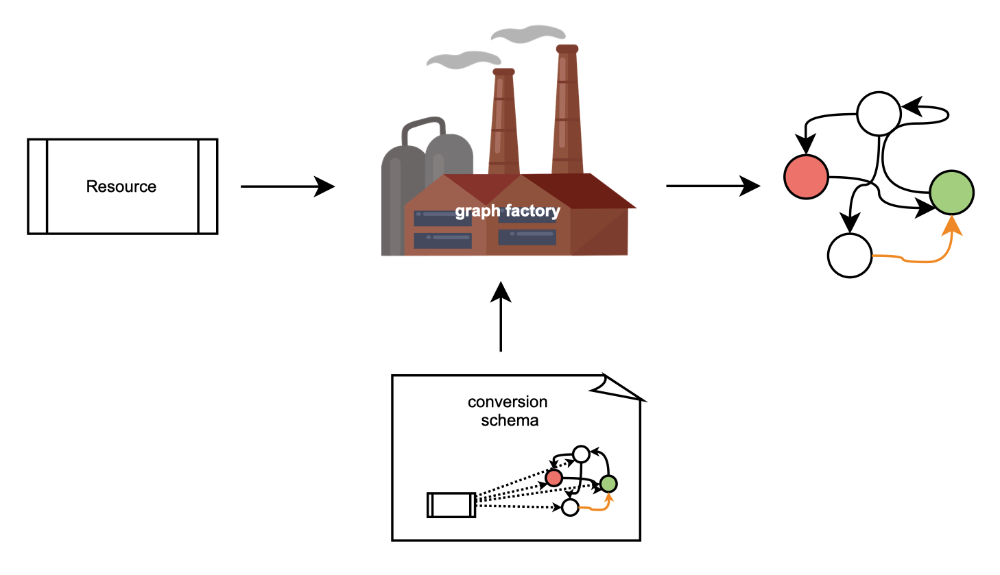
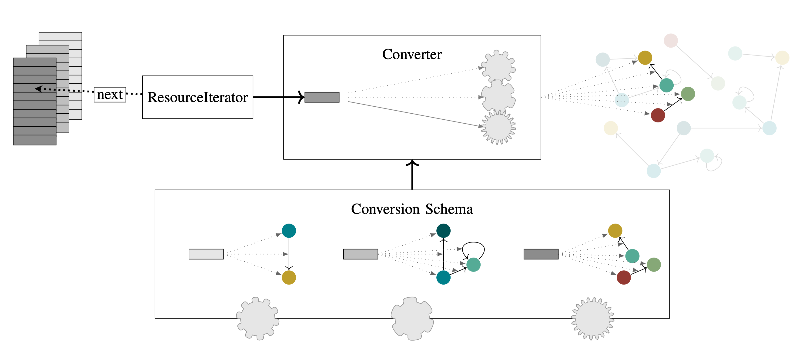

Introduction
============

This chapter will give you an overview of how *rel2graph* works and a first intuition on 
how to interact with it. Details on how the individual parts of the library work can be 
found in later chapters. Simplified, the library works like a factory that converts an input, 
some relational data, into an output, a neo4j_ graph. 
The factory input is called a |Resource|. A |Resource| can wrap any relational entity. 
For every supplied resource, the factory will produce a graph. 
We define a |convschema| ahead that specifies the *"factory blueprints"*: 
what it produces and how. Once the factory is set up and knows the schema, 
we can keep supplying it with resources without writing more code. 

Since there might be different types of resources, we build a factory per resource type. 
One specifies all the "blueprints" for all the factories in thr |convschema| file. 
A |Converter|, the main object of *rel2graph*, will take this file and construct all the factories 
based on your "blueprints". For a set of supplied resources the |Converter| will automatically select 
the correct factory, use it to produce a graph out of the resource and merge the produced graph with 
the full neo4j_ graph. We supply resources to the converter with a |ResourceIterator|. 
This iterator keeps track of what the next resource to process is. 
The |Resource| and |ResourceIterator| classes can be fully customised. 
A simple version of it might just point to a specific element in a list of resources, 
as visualised in the image below. The |Converter| iteratively asks the |ResourceIterator| 
for the next resource until the iterator reports no more resources to process.

At the simplest, the library consists of the following 4 parts: 

- |Converter|: handles all the factories and builds the graph.
- The |convschema|, specifying what is converted into what. 
- |Resource|: A wrapped relational entity 
- |ResourceIterator|: An iterator for the to-be-processed resources. You can also use the provided :py:class:`IteratorIterator` to iterate over multiple iterators.

The next chapters will go into detail about these 4 parts. 
In later chapters, we will show you how you can insert your custom code into one of 
these factories by creating :doc:`Wrapper <wrapper>`. Wrappers can apply a pre- and/or postprocessing to a factory. 

.. image:: assets/images/wrapper.jpg
    :width: 800
    :alt: rel2graph wrapper

A wrapper behaves like a factory and can be wrapped into another wrapper. 
This allows you to insert arbitrary customisation into the conversion and adapt it to your use-case.

.. |Resource| replace:: :py:class:`Resource <rel2graph.Resource>`
.. |Converter| replace:: :py:class:`Converter <rel2graph.Converter>`
.. |ResourceIterator| replace:: :py:class:`ResourceIterator <rel2graph.ResourceIterator>`
.. |convschema| replace:: :doc:`conversion schema <conversion_schema>`
.. _neo4j: https://neo4j.com/
.. _py2neo: https://py2neo.org/2021.1/index.html
