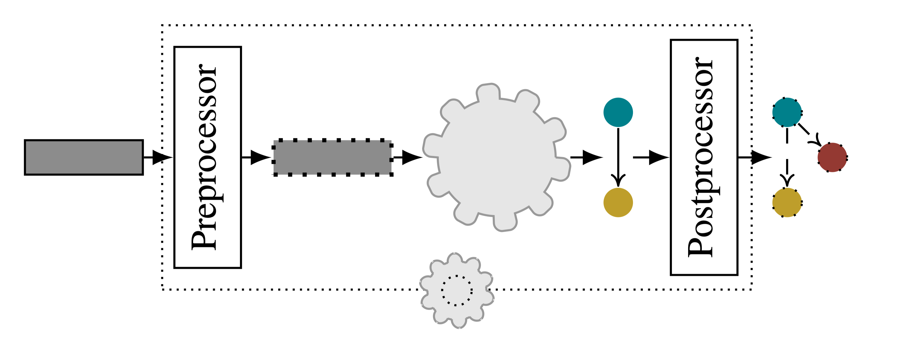

Introduction
============

This chapter will give you an overview of how *Data2Neo* works and a first intuition on 
how to interact with it. Details on how the individual parts of the library work can be 
found in later chapters. At the heart of Data2Neo is the concept of a factory that
converts an input (relational data) into an output (a neo4j_
graph). 
The factory input is called a |Resource| which can represent
any relational entity. 
For every supplied |Resource| , the factory
will produces a corresponding graph based on a predefined
|convschema| that specifies the factory's *blueprints*.
Once the factory is set up and knows the schema, additional
|Resource| s can be supplied without the need for additional
coding. The |Resource|  is an API that the user
must connect to their data source.

.. image:: assets/images/overview.png
    :width: 800
    :alt: Data2Neo overview

The library supports the use of different resource types,
allowing the user to process various entities. Data2Neo then
constructs one factory per resource type.
At the core of the library lies the |Converter|. The |Converter| is the main object the
developer interacts with and is responsible for constructing and
managing all the factories based on a provided |convschema|. 
When provided with a set of |Resource| s, the |Converter| automatically
sends each |Resource| to the corresponding factory and merges
the output with the full neo4j_ graph. We supply resources to the converter with a |ResourceIterator|, 
which is a simple python iterator that keeps track of the next |Resource| to be processed.
The |Resource| and |ResourceIterator| are abstract objects that must be customized by the user. The library comes with a few prebuilt iterators, 
see :doc:`Resource <resource>` for more information.
A simple version of the ResourceIterator might just point
to a specific element in a list of resources. More complex
implementations might lazily fetch data as the library requests
it. The |Converter| iteratively asks the |ResourceIterator| 
for the next resource until the iterator reports no more resources to process.

Lastly, it is possible to extend the factories by injecting custom pre- or postprocessing functions, called Wrappers, into
the Data2Neo pipeline. :doc:`Wrappers <wrapper>` allow the user to specify
arbitrary procedures that are applied to a Resource just before
it is passed to the wrapped factory, or to the immediate output
of the factory before it is passed back to the Converter.
Wrappers can also be wrapped, allowing the user to build
complex data integration pipelines. :doc:`Read more here. <wrapper>`

.. |Resource| replace:: :py:class:`Resource <Data2Neo.Resource>`
.. |Converter| replace:: :py:class:`Converter <Data2Neo.Converter>`
.. |ResourceIterator| replace:: :py:class:`ResourceIterator <Data2Neo.ResourceIterator>`
.. |convschema| replace:: :doc:`conversion schema <conversion_schema>`
.. _neo4j: https://neo4j.com/
.. _py2neo: https://py2neo.org/2021.1/index.html
