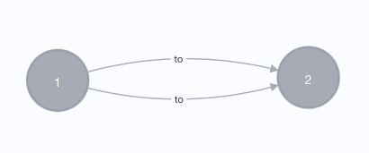

Py2neo Extensions
=================

The rel2graph library relies on py2neo for the connection to a neo4j graph. 
As py2neo is limited for specific use-cases, this library provides some helpful extensions.

Graph with parallel relations
~~~~~~~~~~~~~~~~~~~~~~~~~~~~~

Py2neo does not allow the creation of parallel relations: Two parallel relations of the same type between the same two nodes. 
If two parallel relations are created, they are automatically merged.

Use the :py:class:`GraphWithParallelRelations <rel2graph.py2neo_extensions.GraphWithParallelRelations>` class to initiate your graph before passing it to the rel2graph |Converter| to allow for such parallel relations. The  :py:class:`GraphWithParallelRelations <rel2graph.py2neo_extensions.GraphWithParallelRelations>` behaves like a normal py2neo graph but supports the creation of parallel relations. 
If you want to merge relations with a  :py:class:`GraphWithParallelRelations <rel2graph.py2neo_extensions.GraphWithParallelRelations>` you can either specify a :ref:`primary attribute for a relation <conversion_schema:merging relations>` or :ref:`use the provided wrapper <py2neo_extensions:merge relations with no primary key>`.

.. code-block:: python

    from rel2graph.py2neo_extensions import GraphWithParallelRelations
    from rel2graph import Converter ...
    graph = GraphWithParallelRelations(scheme="http", host="localhost", port=7474,  auth=('neo4j', 'password'))
    iterator = ...
    schema = ...
    converter = Converter(schema, iterator, graph)
    converter()

Note that only ``graph.create`` and ``graph.merge`` are tested. 
No other functionality is guaranteed. It is suggested to use the normal ``py2neo.Graph`` class for interaction with a graph other 
than a conversion with rel2graph. Querying a neo4j graph with parallel relations should be no problem with the normal ``py2neo.Graph`` class. 

Merge relations with no primary key
-----------------------------------

If you require the :py:class:`GraphWithParallelRelations <rel2graph.py2neo_extensions.GraphWithParallelRelations>` but still want to merge relations that don't have a primary key, you can use the provided ``MERGE_RELATION`` wrapper. For the wrapper to be
registered with the converter, make sure to import it.

.. code-block:: python

    from rel2graph.py2neo_extensions import GraphWithParallelRelations, MERGE_RELATION
    from rel2graph import Converter ...
    graph = GraphWithParallelRelations()
    iterator = ...
    schema = """
    ENTITY("MyEntity"):
        NODE("MyNode") start:
            + id = MyEntity.startid

        NODE("MyNode") end:
            + id = MyEntity.endid

        MERGE_RELATION(RELATION(start, "related_to", end)):
        MERGE_RELATION(RELATION(start, "related_to", end)):
    """
    converter = Converter(schema, iterator, graph)
    converter() # will only create one relation between the startid node and the endid node

.. |Resource| replace:: :py:class:`Resource <rel2graph.Resource>`
.. |Converter| replace:: :py:class:`Converter <rel2graph.Converter>`
.. |ResourceIterator| replace:: :py:class:`ResourceIterator <rel2graph.ResourceIterator>`
.. |IteratorIterator| replace:: :py:class:`IteratorIterator <rel2graph.IteratorIterator>`