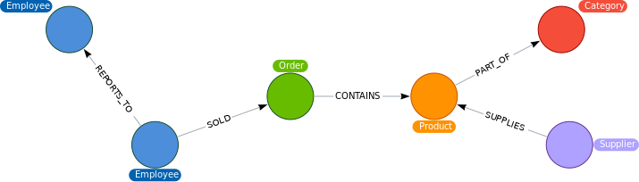

Quick Start
===========

.. note::

    This is a quick start guide for the library. For more details, please checkout the full documentation.

As a first example, we will convert the **Northwind Traders** dataset into a Neo4j graph. The complete example code can be found `here <https://github.com/sg-dev/rel2graph/blob/main/examples/example_northwind.ipynb>`_.
The official Neo4j documentation has a `tutorial <https://neo4j.com/docs/getting-started/current/appendix/tutorials/guide-import-relational-and-etl/>`_ on how to import the Northwind Traders dataset using **direct import** with CYPHER.
We will use the same dataset, but instead of using CYPHER, we will use the rel2graph library to convert the data into a graph.

Rel2graph decomposes the data integration process into three distinct parts:

- **Resource Abstraction:** We encapsulate each relational entity in a |Resource|, with each |Resource| possessing a type corresponding to, for example, its table name. A |ResourceIterator| is employed to iterate over all Resources to be converted. This abstraction provides us with the flexibility to accommodate various data sources. Rel2graph currently has pre-implemented iterators for :ref:`SQLite databases <resource:SQLite>` and :ref:`pandas Dataframes <resource:Pandas>`.
- **Conversion Schema:** The :doc:`Convertion Schema <conversion_schema>` outlines how each Resource type should be managed, effectively serving as a blueprint for integrating each Resource type.
- **Converter:** The |Converter| takes data from the |ResourceIterator| and integrates it into an existing knowledge graph, based on the specifications provided in the :doc:`Convertion Schema <conversion_schema>`.

Example "Northwind"
~~~~~~~~~~~~~~~~~~~

The Northwind Traders dataset depicts a product sale system. Most importantly it contains the tables Suppliers, Products, Categories, Employees and Orders. 

.. image:: assets/images/Northwind_diagram_focus.jpg
    :width: 800
    :alt: Northwind diagram
    :target: https://neo4j.com/docs/getting-started/current/_images/Northwind_diagram_focus.jpg

In order to more naturally represent the relationships between these entities, we want to convert the data into a graph that looks like the following:

We are now going to write the :doc:`Convertion Schema <conversion_schema>` for this conversion. The schema is written in a YAML style config file. In this config file we specify, which entities are to be converted into which nodes and which relationships.
For now, let us focus on the Orders table. For each order we want to create a node with the label ``Order`` and the attributes **orderID** and **shipName**. 
We also want to create a `CONTAINS` relationship between the order node and the ``Product`` node, which is linked to the Order through the ProductID. 
The relationship should have the attributes **unitPrice** and **quantity**. The order node also needs to be connected to an ``Employee`` node with a `SOLD` relationship.  The schema for this conversion is shown below:

.. code-block:: yaml
    :caption: schema.yaml

    ENTITY("Orders"):
        NODE("Order") order:
            + orderID = INT(orders.OrderID)
            - shipName = orders.ShipName

        RELATIONSHIP(order, "CONTAINS", MATCH("Product", productID=orders.ProductID)):
            - unitPrice = FLOAT(orders.UnitPrice)
            - quantity = FLOAT(orders.Quantity)

        RELATIONSHIP(MATCH("Employee", employeeID = Orders.EmployeeID), "SOLD", order):

Refer to the :doc:`conversion schema chapter <conversion_schema>`  for more details on the syntax.
The full schema for all tables can be found `here <https://github.com/sg-dev/rel2graph/blob/main/examples/example_northwind.ipynb>`_. If performance is an issue, refer to the :ref:`performance chapter <converter:peformance optimization>` for more details on how to optimize the schema.

Note that we have used the keywords ``FLOAT`` and ``INT`` in the schema. These are so called :doc:`wrappers <wrapper>`. Wrappers can be used to insert arbitrary Python code into the conversion process, in this case to convert the data to the correct datatype.
Fortunatly, the library comes with a set of  :doc:`pre-implemented wrappers <common_modules>`. To use the ``INT`` and ``FLOAT`` wrappers we simply need to import ``import rel2graph.common_modules.types``. 

We can also define our Python functions and register them with rel2graph. As an example, let's consider a scenario where the UnitPrice column in the Orders table contains values in different currencies. 
We can define a function, CONVERTCURRENCY, to standardise these values into a single currency, register it, and then use it in the conversion schema.
:doc:`Read more about wrappers here <wrapper>`.

.. code-block:: python

    from rel2graph import register_attribute_postprocessor, Attribute

    @register_attribute_postprocessor
    def CONVERTCURRENCY(attribute, currency):
        if currency == "USD":
            # convert to USD
            new_value = ...
        elif 
        ...
        return Attribute(attribute.key, new_value)

    """ Now you can use the CONVERTCURRENCY function in the conversion schema
        RELATION(order, "CONTAINS", MATCH("Product", productID=orders.ProductID)):
            - unitPrice = CONVERTCURRENCY(FLOAT(orders.UnitPrice), "USD")
            - quantity = FLOAT(orders.Quantity)
    """

Finally, we need to create a |ResourceIterator| that iterates over the data in the Northwind database.  
We will use the :py:class:`PandasDataFrameIterator <rel2graph.relational_modules.pandas.PandasDataFrameIterator>` from ``rel2graph.relational_modules.pandas``. We will also use the :py:class:`IteratorIterator <rel2graph.IteratorIterator>`, which can wrap multiple iterators to handle multiple dataframes.
Since pandas DataFrames have no types/table names associated with it, we need to specify the name when creating a :py:class:`PandasDataFrameIterator <rel2graph.relational_modules.pandas.PandasDataFrameIterator>`.
The Python code looks like this:

.. code-block:: python

    import neo4j
    import pandas as pd
    from tqdm.notebook import tqdm

    from rel2graph.relational_modules.pandas import PandasDataFrameIterator
    from rel2graph import IteratorIterator
    from rel2graph import Converter
    from rel2graph.utils import load_file
    
    import rel2graph.common_modules.types # For FLOAT, INT, etc. wrappers
    # This is required because the pandas dataframe iterator will convert all values 
    # to int64 which is not supported by neo4j

    uri = "bolt://localhost:7687"
    auth = neo4j.basic_auth("neo4j", "password") # CHANGE TO YOUR CREDENTIALS
    
    # Create IteratorIterator
    files = ["categories", "employees", "orders", "products", "suppliers"]
    iterators = []
    for file in files:
        df = pd.read_csv(f"https://raw.githubusercontent.com/neo4j-documentation/developer-resources/gh-pages/data/northwind/{file}.csv")
        # The DataFrameIterator takes two arguments: the dataframe and the name of the table
        iterators.append(PandasDataFrameIterator(df, file)) 

    # The IteratorIterator takes a list of iterators and iterates over them sequentially
    iterator = IteratorIterator(iterators)

    # Create converter instance with schema, the final iterator and the graph
    # We assume the schema is stored in a file called schema.yaml
    converter = Converter(load_file("schema.yaml"), iterator, uri, auth, num_workers = 5)
    # Start the conversion
    converter(progress_bar=tqdm)

`Full Code Example <https://github.com/sg-dev/rel2graph/blob/main/examples/example_northwind.ipynb>`_

.. |Resource| replace:: :py:class:`Resource <rel2graph.Resource>`
.. |Converter| replace:: :py:class:`Converter <rel2graph.Converter>`
.. |ResourceIterator| replace:: :py:class:`ResourceIterator <rel2graph.ResourceIterator>`