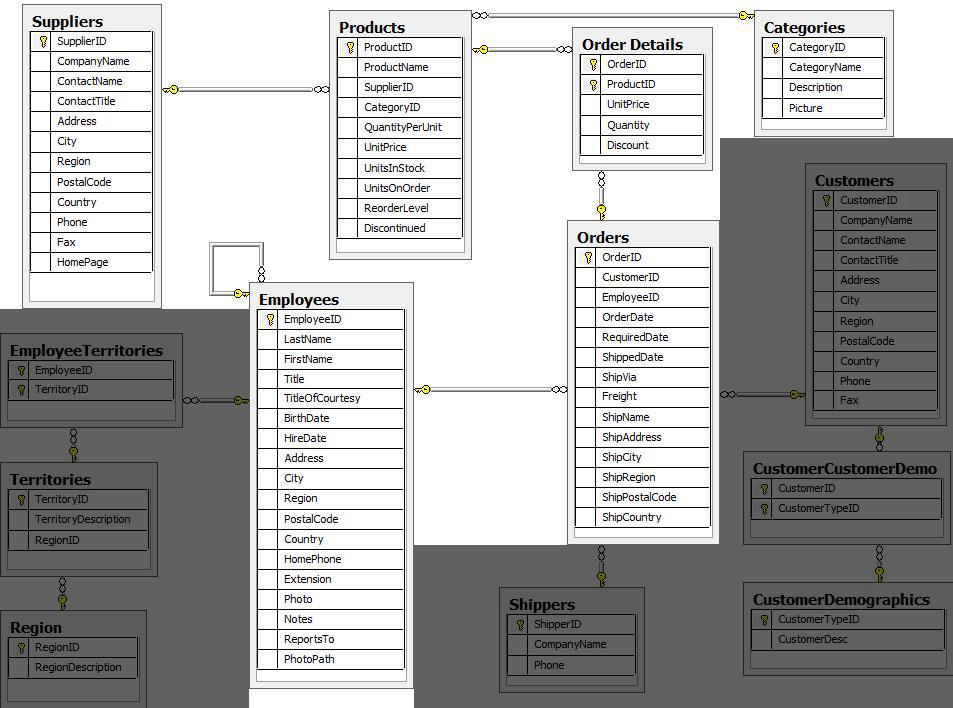

Quick Start
===========

.. note::

    This is a quick start guide for the library. For more details, please checkout the full documentation.

As a first example we will convert the **Northwind Traders** dataset into a Neo4j graph. The full example code can be found `here <https://github.com/sg-dev/rel2graph/tree/main/examples>`_.
The official Neo4j documentation has a `tutorial <https://neo4j.com/docs/getting-started/current/appendix/tutorials/guide-import-relational-and-etl/>`_ on how to import the Northwind Traders dataset with **direct import** in CYPHER.
We will use the same dataset, but instead of using CYPHER, we will use the rel2graph library to convert the data into a graph.

The library itself consists of 4 basic elements that are essential for the conversion: The |ResourceIterator| iterates over the source data, the :doc:`convertion schema <conversion_schema>` specifies what is converted into what, the |Converter|, which performs the conversion itself, and finally :doc:`wrappers <wrapper>`, which can be used to add arbitrary additional functionality to the conversion process.
The iterator can be implemented for arbitrary data in relational format. Rel2graph currently has pre-implemented iterators for :ref:`SQLite databases <resource:SQLite>` and :ref:`pandas Dataframes <resource:Pandas>`.

Example "Northwind"
~~~~~~~~~~~~~~~~~~~

The Northwind Traders dataset depicts a product sale system. Most importantly it contains the tables Suppliers, Products, Categories, Employees and Orders. 

In order to more naturally represent the relationships between these entities, we want to convert the data into a graph that looks like the following:

.. image:: assets/images/northwind_graph_simple.png
    :width: 800
    :alt: Northwind graph schema
    :target: https://neo4j.com/docs/getting-started/current/_images/northwind_graph_simple.svg

We will now write the :doc:`convertion schema <conversion_schema>` for this conversion. The schema is written in a YAML style config file. In this config file we specify, which entites are converted into which nodes and which relations.
Let us focus on the Order table first. For each order we want to create a node with label ``Order`` and the attributes **orderID** and **shipName**. 
We also want to create a relation `CONTAINS` between the order node and the ``Product`` node, which is connected to the order via the ProductID. 
The relation should have the attributes **unitPrice** and **quantity**. Further the order must be connected to an ``Employee`` node with a `SOLD` relation. The schema for this conversion looks like this:

.. code-block:: yaml
    :caption: schema.yaml

    ENTITY("Orders"):
        NODE("Order") order:
            + orderID = INT(orders.OrderID)
            - shipName = orders.ShipName

        RELATION(order, "CONTAINS", MATCH("Product", productID=orders.ProductID)):
            - unitPrice = FLOAT(orders.UnitPrice)
            - quantity = FLOAT(orders.Quantity)

        RELATION(MATCH("Employee", employeeID = Orders.EmployeeID), "SOLD", order):

Refer to the :doc:`conversion schema chapter <conversion_schema>`  for more details on the syntax.
The full schema for all tables can be found `here <https://github.com/sg-dev/rel2graph/tree/main/examples>`_. If performance is an issue, refer to the :ref:`performance chapter <converter:peformance optimization>` for more details on how to optimize the schema.

Note that we have used the ``FLOAT`` and ``INT`` keywords in the schema. These are so called :doc:`wrappers <wrapper>`. Wrappers can be used to insert arbitrary python code into the conversion process, in this case to convert the data into the correct type.
Luckily the library ships with a set of  :doc:`pre-implemented wrappers <common_modules>`. To use the ``INT`` and ``FLOAT`` wrappers we need to simply import ``import rel2graph.common_modules.types``. 

But we can also define our python functions and register them with rel2graph. As an example, let's consider a scenario where the UnitPrice column in the Orders table contains values in different currencies. 
We can define a function, CONVERTCURRENCY, to standardize these values to a single currency, register it, and then use it in the conversion schema.
:doc:`Read more about wrappers here <wrapper>`.

.. code-block:: python

    from rel2graph import register_attribute_postprocessor, Attribute

    @register_attribute_postprocessor
    def CONVERTCURRENCY(attribute, currency):
        if currency == "USD":
            # convert to USD
            new_value = ...
        elif 
        ...
        return Attribute(attribute.key, new_value)

    """ Now you can use the CONVERTCURRENCY function in the conversion schema
        RELATION(order, "CONTAINS", MATCH("Product", productID=orders.ProductID)):
            - unitPrice = CONVERTCURRENCY(FLOAT(orders.UnitPrice), "USD")
            - quantity = FLOAT(orders.Quantity)
    """

We now need to create a |ResourceIterator| that iterates over the data in the Northwind database. 
We will use the :py:class:`PandasDataFrameIterator <rel2graph.relational_modules.pandas.PandasDataFrameIterator>` from ``rel2graph.relational_modules.pandas``. Further we will use the :py:class:`IteratorIterator <rel2graph.IteratorIterator>` that can wrap multiple iterators to handle multiple dataframes.
Since a pandas dataframe has no type/table name associated, we need to specify the name when creating a :py:class:`PandasDataFrameIterator <rel2graph.relational_modules.pandas.PandasDataFrameIterator>`.
The full code looks like this:

.. code-block:: python

    from py2neo import Graph
    import pandas as pd 
    from tqdm import tqdm

    from rel2graph.relational_modules.pandas import PandasDataframeIterator 
    from rel2graph import IteratorIterator, Converter
    import rel2graph.common_modules.types # import types module to use INT and FLOAT
    from rel2graph.utils import load_file
    

    # Create a connection to the neo4j graph with the py2neo Graph object
    graph = Graph(scheme="bolt", host="localhost", port=7687,  auth=('neo4j', 'password')) 
    graph.delete_all()

    # Create IteratorIterator
    files = ["categories", "employees", "orders", "products", "suppliers"]
    iterators = []
    for file in files:
        df = pd.read_csv(f"data/{file}.csv")
        iterators.append(PandasDataframeIterator(df, file))

    iterator = IteratorIterator(iterators)

    # Create converter instance with schema, the final iterator and the graph
    converter = Converter(load_file("schema.yaml"), iterator, graph, num_workers = 5)
    # Start the conversion
    converter(progress_bar=tqdm)

.. |Resource| replace:: :py:class:`Resource <rel2graph.Resource>`
.. |Converter| replace:: :py:class:`Converter <rel2graph.Converter>`
.. |ResourceIterator| replace:: :py:class:`ResourceIterator <rel2graph.ResourceIterator>`