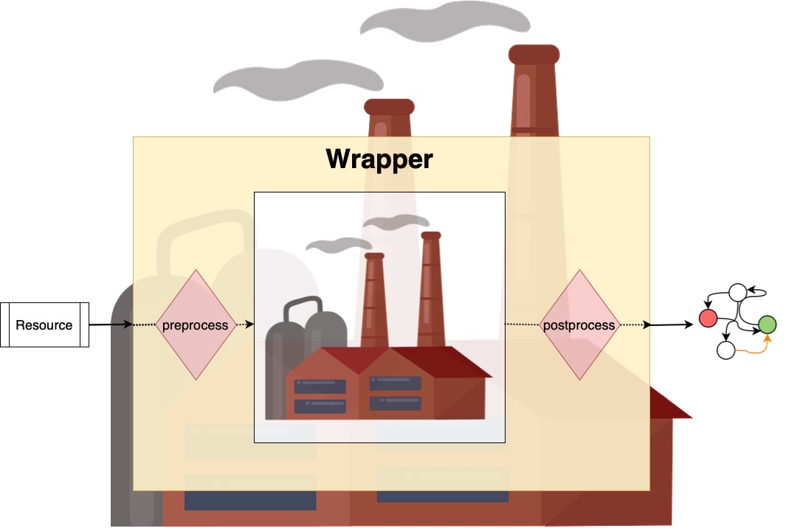
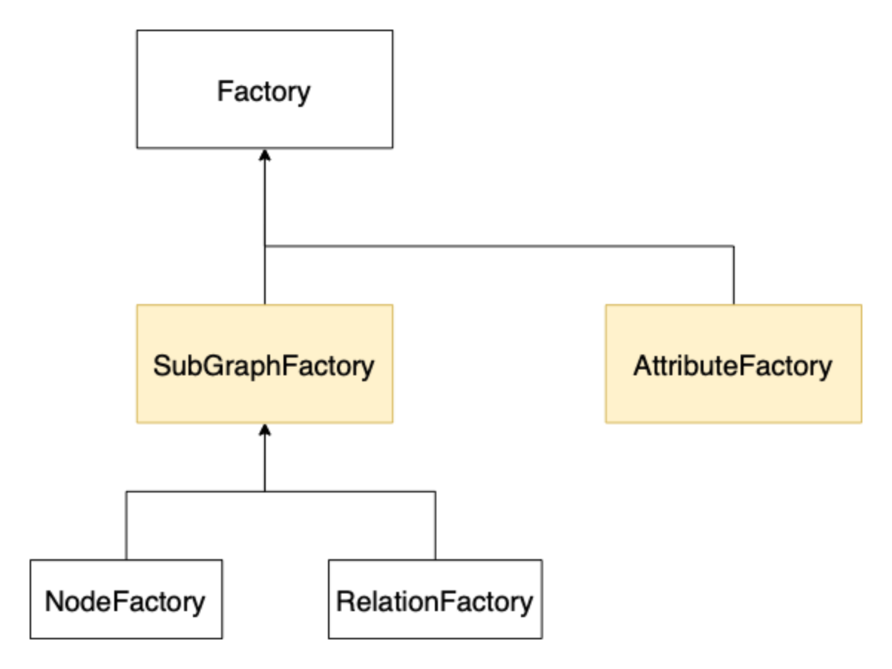

Building your own Wrappers
==========================

A wrapper allows you to inject custom code into the conversion. 
A wrapper inserts preprocessing and postprocessing before and after a wrapped factory. 
There are three possibilities on how to create such factory wrappers. 
The simplest way is to define either a **preprocessor** (processing the |Resource| before it is passed to the factory) 
or a **postprocessor** (processing the factory's output). They are created by writing a simple python function. 
If you need more sophisticated functionality that uses both, you can define an entire wrapper class. 
This chapter will guide you through the creation of your own wrappers.

Background
~~~~~~~~~~

First, we need to be aware of the different factory types *rel2graph* uses. 
The input of every factory is always a resource, but depending on the type the output varies. 
To write wrappers, we need to distinguish the two main factory types: **SubgraphFactories** and **AttributeFactories**. 

AttributeFactories
------------------

*AttributeFactories* produce |Attribute| objects. An |Attribute| is a simple object that behaves as follows:

.. code-block:: python

    from rel2graph import Attribute
    myattr = Attribute("mykey", "myvalue")
    key = myattr.key # get the key of the attribute
    value = myattr.value # get the value of the attribute

An |Attribute| is immutable, so it can't be changed. 
If you want to change an existing attribute, you must create a new one with the key/value of the existing attribute including the change and return the new attribute.

Whenever you refer to an entity attribute, the parser in the |Attribute| will create an *AttributeFactory* 
(for example ``mykey = EntityName.attribute`` or just ``EntityName.attribute``). 
Note that a static attribute will also create an AttributeFactory that will just ignore the input resource (for example, ``key = "staticstring"``). 
Given a resource the AttributeFactory that is created from ``mykey = EntityName.attribute`` will produce the 
attribute ``Attribute("mykey", **value at resource.attribute**)``.

SubgraphFactories
-----------------

*SubgraphFactories* produce, as the name suggests, 
a py2neo `Subgraph <https://py2neo.org/2021.1/data/index.html#subgraph-objects>`_ object containing py2neo 
`Nodes <https://py2neo.org/2021.1/data/index.html#node-objects>`_ and `Relationships <https://py2neo.org/2021.1/data/index.html#relationship-objects>`_. 
When your write ``NODE(...)`` or ``RELATION(...)`` in the schema file, 
the parser will create a *NodeFactory* or a *RelationFactory*, respectively, out of your specification. 
Both of them are *SubgraphFactories*. The *NodeFactory* returns a subgraph with a maximum of one node, and the 
*RelationFactory* returns a subgraph with an arbitrary number of relationships. 
The nodes and relations of a subgraph can be accessed with ``subgraph.nodes`` and ``subgraph.relationships``. 
Please check out the documentation of the py2neo objects for details about how to operate with them (click on the links).

Registering
~~~~~~~~~~~

When we write a pre/postprocessor function or a wrapper class, we need to register it 
such that the |Converter| knows of its existence. 
Registering is done with python **decorators**. When registering pre/postprocessors we need to specify if it's 
for an *AttributeFactory* or a *SubGraphFactory*. 
A wrapper class needs no further specification. The following decorators are available for registering:

- ``register_attribute_preprocessor``
- ``register_attribute_postprocessor``
- ``register_subgraph_preprocessor``
- ``register_subgraph_postprocessor``
- ``register_wrapper`` 

The library will not check if your registered functions/classes match the expected format. 
If the function behaves other than expected, this will result in undefined behaviour during runtime. 
Make sure you define your functions/classes correctly.

**Attention**: If you require shared state between wrappers or wrapper calls you need to explicitly tell rel2graph, e.g. a wrapper that counts the number of processed resources. Read more about it in the :ref:`Global Shared State <converter:Global Shared State>` chapter.

Preprocessors
~~~~~~~~~~~~~

A preprocessor transforms the resource before it reaches the factory. 
We write a function that takes a resource as input to define a preprocessor. 
If a factory gets ``None`` as input, it will simply create nothing. 
Therefore, if you want the factory only to produce an object if a condition is given, 
you can write a preprocessor and return ``None`` if the resource does not meet the requirement.

We can pass static (string) arguments from the schema file to a preprocessor. 
Simply add them in your function as parameters behind the resource and specify the arguments in the schema file.

Some examples:

.. code-block:: python

    from rel2graph import register_attribute_preprocessor, register_subgraph_preprocessor

    @register_attribute_preprocessor
    def my_attr_preprocessor(resource: Resource) -> Resource:
        # do something to the resource
        ...
        return resource

    @register_subgraph_preprocessor
    def only_create_subgraph_if_preprocessor(resource: Resource, key: str, value="can also have a default value": str) -> Resource:
        """Only creates the subgraph if resource[key] == value"""
        if resource[key] != value:
            return None # do not create this subgraph
        return resource

schema.yaml

.. code-block:: yaml

    ENTITY("type"):
        only_create_subgraph_if_preprocessor(NODE("label"), "somekey", "specificvalue"):
            - mykey = my_attr_preprocessor(type.myvalue)

The node "label" is only created if the attribute "somekey" of the "type" resource is exactly "specificvalue".

Postprocessors
~~~~~~~~~~~~~~

A postprocessor transforms the result of the factory. To define a postprocessor, we write a function that takes an 
attribute/subgraph as input, depending on the type. As described in :ref:`wrapper:Preprocessors`, 
one can pass static (string) arguments to a postprocessor from the schema file.

Some examples:

.. code-block:: python

    from rel2graph import register_attribute_postprocessor, register_subgraph_postprocessor, Attribute

    @register_attribute_postprocessor
    def attr_append_postprocessor(attribute: Attribute, value=" appendix": str) -> Attribute:
        """Append the value to the attribute"""
        new_attr = Attribute(attribute.key, attribute.value + value) # Attribute is immutable -> create new
        return new_attr

    @register_subgraph_postprocessor
    def my_subgraph_postprocessor(subgraph: Subgraph) -> Subgraph:
        # do something with the subgraph
        ...
        return subgraph

schema.yaml

.. code-block:: yaml

    ENTITY("type"):
        my_subgraph_postprocessor(NODE(attr_append_postprocessor("label"))):
            - mykey = an_attr_preprocessor(attr_append_postprocessor(type.myvalue)) # you can mix pre and postprocessors
            - another = attr_append_postprocessor("static value", "i append this")

This will create a node with label "label appendix". The value of the attribute "another" is "static valuei append this".

Full Wrappers
~~~~~~~~~~~~~

If you require more sophisticated functionality, like, for example, passing information from preprocessing to postprocessing or a state, 
you can create full wrapper classes. They need to inherit from either |SubgraphWrapper| or |AttributeWrapper|. 
Their constructor takes as the first parameter the wrapped factory, with which the parent's constructor is called. 
As for pre/postprocessor functions, the constructor can take static string arguments from the schema file. 
Further, the wrapper class needs to implement the ``construct(resource)`` method. 
To get the resulting product of the wrapped factory, call ``super().construct(resource)`` in your ``construct`` function.

The following example checks that at least one relation exists in the resulting subgraph, 
iff the provided resource is not None. This could not be done with simple pre/postprocessor functions. 
Obviously, everything that can be done with pre/postprocessor functions can also be done with full wrapper classes. 

.. code-block:: python

    from rel2graph import SubGraphFactoryWrapper, register_wrapper

    @register_wrapper
    class REQUIRED(SubgraphFactoryWrapper):
        def __init__(factory: SubgraphFactory, static_string_parameter: str):
            super().__init__(factory)
            self.error_msg = static_string_parameter

        def construct(resource: Resource) -> Subgraph:
            subgraph = super().construct(resource)
            if resource is None:
                return subgraph # resource was None -> no check
            else:
                if len(subgraph.relationships) == 0:
                    raise Exception(self.error_msg)
                return subgraph # condition is met -> return produced subgraph

schema.yaml

.. code-block:: yaml

    ENTITY("type"):
        ...
        REQUIRED(RELATION(from, "relation type", MATCH("other", key="value")), "No match for label other and key=value"):

.. |Resource| replace:: :py:class:`Resource <rel2graph.Resource>`
.. |Converter| replace:: :py:class:`Converter <rel2graph.Converter>`
.. |ResourceIterator| replace:: :py:class:`ResourceIterator <rel2graph.ResourceIterator>`
.. |Attribute| replace:: :py:class:`Attribute <rel2graph.Attribute>`
.. |SubgraphWrapper| replace:: :py:class:`SubgraphFactoryWrapper <rel2graph.SubgraphFactoryWrapper>`
.. |AttributeWrapper| replace:: :py:class:`AttributeFactoryWrapper <rel2graph.AttributeFactoryWrapper>`

.. _neo4j: https://neo4j.com/
.. _py2neo: https://py2neo.org/2021.1/index.html
